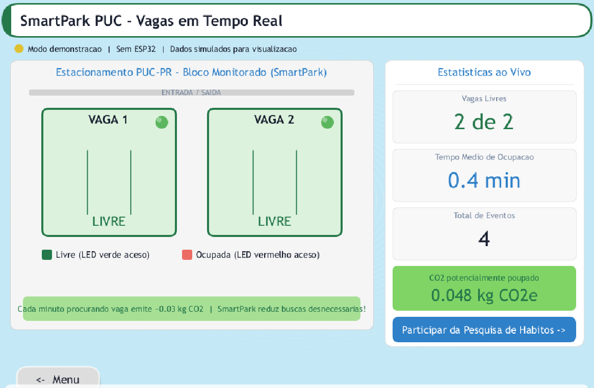
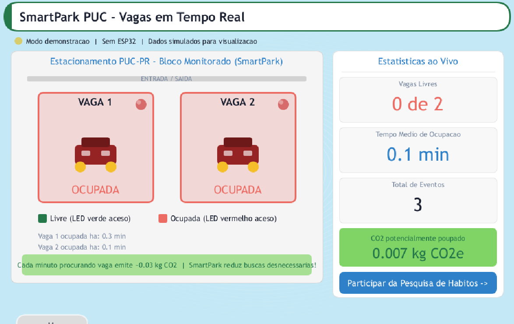

<div align="center">

# 🅿️ SmartPark PUC

**Monitoramento inteligente de vagas de estacionamento**  
ESP32 · MicroPython · MQTT · Processing · Wokwi

[](https://wokwi.com/projects/465089138268468225)
[](https://micropython.org/)
[](LICENSE)
[](https://www.pucpr.br/)

---

*Disciplina: Fundamentos de Sistemas Ciberfísicos — PUCPR 2026.1*

</div>

---

## 📌 O Problema

Os totens da PUC mostram só **"lotado" ou "disponível"** — sem indicar onde exatamente há vaga livre. O motorista entra, percorre o corredor inteiro, não encontra nada e volta com o motor ligado. Resultado: **tempo perdido + CO₂ desnecessário**.

Estudos mostram que até **30% do tráfego urbano** é causado por busca de estacionamento.

## 💡 A Solução

Um sensor HC-SR04 por vaga conectado ao ESP32. Se detectar objeto a menos de 20 cm:

- 🔴 **LED vermelho** → vaga ocupada  
- 🟢 **LED verde** → vaga livre  
- 🔊 **Buzzer** → toca quando o estacionamento está totalmente lotado  
- 📊 **Dashboard** → exibe status em tempo real via MQTT

**Custo por vaga: ~R$ 35**

---

## 🎬 Vídeo de demonstração

> 📹 *Em breve — link do YouTube será adicionado aqui*

🔗 **Simulação ao vivo:** [wokwi.com/projects/465089138268468225](https://wokwi.com/projects/465089138268468225)

---

## 🧠 Arquitetura CPS

```
┌─────────────────────────────────────────────────────────┐
│                     MUNDO FÍSICO                        │
│   [Veículo]                          [Veículo]          │
│      ↕                                    ↕             │
│  HC-SR04 Vaga 1                      HC-SR04 Vaga 2     │
└──────────┬───────────────────────────────┬──────────────┘
           │           SENSING             │
┌──────────▼───────────────────────────────▼──────────────┐
│                  ESP32 DevKit V1                         │
│  COMPUTATION: medir_distancia() → set_led() → MQTT      │
│                                                         │
│  [🟢/🔴 LED Vaga 1]    [🟢/🔴 LED Vaga 2]   ACTUATION  │
│  [🔊 Buzzer — lotado]                                   │
│                                                         │
│  WiFi ──────────────────────────────► MQTT Broker       │
└─────────────────────────────────────────────────────────┘
                                          │  COMMUNICATION
                              ┌───────────▼──────────────┐
                              │  Dashboard Processing     │
                              │  (tempo real via MQTT)    │
                              └──────────────────────────┘
```

| Camada | Componente | O que faz |
|--------|-----------|-----------|
| **Sensing** | HC-SR04 | Mede distância até o carro (mundo físico → digital) |
| **Computation** | ESP32 + MicroPython | Decide se a vaga está ocupada (dist < 20 cm) |
| **Communication** | WiFi + MQTT | Envia o estado das vagas pro dashboard |
| **Actuation** | LED + Buzzer | Sinaliza visualmente e sonoramente |

---

## 🗂️ Estrutura do Repositório

```
smartpark-puc/
├── main.py                  # Firmware MicroPython (ESP32)
├── diagram.json             # Circuito Wokwi
├── relatorio-smartcity.md   # Relatório completo do projeto
├── slides-smartpark.html    # Slides da apresentação (abrir no browser)
└── DashboardProcessingimg/  # Screenshots do dashboard Processing
    ├── VagasLivres.png
    ├── VagasOcupadas.png
    ├── Vaga1Ocupada.png
    └── Vaga2Ocupada.png
```

---

<details>
<summary><h2>💻 Código</h2></summary>

O firmware está em [`main.py`](main.py) e roda direto no ESP32 com MicroPython.

### Estrutura das funções

| Função | O que faz |
|--------|-----------|
| `medir_distancia(trig, echo)` | Dispara pulso ultrassônico e retorna distância em cm |
| `set_led(ocupada, verde, vermelho)` | Acende o LED correto conforme status da vaga |
| `set_buzzer(lotado)` | Liga buzzer PWM 1kHz quando estacionamento está lotado |
| `conectar_wifi()` | Conecta ao WiFi com até 10 tentativas, retorna True/False |
| `publicar(client, payload)` | Serializa e publica JSON no tópico MQTT |
| `main()` | Loop principal: lê sensores → atualiza LEDs → publica se mudou |

### Trecho principal

```python
# LEDs inicializam verde antes de qualquer conexão WiFi
LED_V1.on();  LED_R1.off()   # Vaga 1: livre
LED_V2.on();  LED_R2.off()   # Vaga 2: livre

# No loop:
d1 = medir_distancia(TRIG1, ECHO1)
ocup1 = d1 < LIMIAR_CM          # True se dist < 20 cm
set_led(ocup1, LED_V1, LED_R1)  # Vermelho se ocupada, verde se livre
```

### Payload MQTT

**Tópico:** `smartpark/vagas` — publicado **apenas quando o estado muda**

```json
{
  "vaga1": { "ocupada": true,  "dist_cm": 12.3 },
  "vaga2": { "ocupada": false, "dist_cm": 47.8 }
}
```

### Compatibilidade Wokwi

A `umqtt.simple` não está disponível no Wokwi, então o import é feito com `try/except`. O mesmo código roda em simulação (sem MQTT) e em hardware real (com MQTT).

</details>

---

<details>
<summary><h2>⚡ Eletrônica</h2></summary>

### Componentes utilizados

| Componente | Qtd | Descrição |
|-----------|-----|-----------|
| ESP32 DevKit V1 | 1 | Microcontrolador principal |
| HC-SR04 | 2 | Sensor ultrassônico de distância |
| LED verde 5mm | 2 | Indica vaga livre |
| LED vermelho 5mm | 2 | Indica vaga ocupada |
| Resistor 220Ω | 4 | Proteção dos LEDs |
| Buzzer passivo | 1 | Alerta sonoro de lotação |

### Funcionamento do HC-SR04

O sensor emite um pulso ultrassônico e mede o tempo de retorno do eco:

```
distância (cm) = (tempo_eco_µs × 0,0343) / 2
```

- `0,0343` = velocidade do som em cm/µs (343 m/s a 20°C)
- Divisão por 2 porque o som faz ida e volta
- Timeout em 30 ms → retorna 999 cm (sem objeto = vaga livre)

### ⚠️ Atenção em hardware real

O pino ECHO do HC-SR04 fornece **5V**, mas o ESP32 suporta apenas **3,3V** nos GPIOs. Em hardware real, use um divisor resistivo:

```
ECHO ──[1kΩ]──┬── GPIO ESP32
              [2kΩ]
              │
             GND
```

Na simulação Wokwi isso não é necessário.

</details>

---

<details>
<summary><h2>🔌 Pinagem</h2></summary>

### Sensores HC-SR04

| Pino sensor | ESP32 — Vaga 1 | ESP32 — Vaga 2 |
|-------------|---------------|---------------|
| `VCC` | 3V3 | 3V3 |
| `GND` | GND | GND |
| `TRIG` | GPIO 5 | GPIO 19 |
| `ECHO` | GPIO 18 | GPIO 21 |

### LEDs

| LED | GPIO | Resistor | Estado |
|-----|------|----------|--------|
| Verde Vaga 1 | GPIO 2 | 220Ω | ON = livre |
| Vermelho Vaga 1 | GPIO 4 | 220Ω | ON = ocupada |
| Verde Vaga 2 | GPIO 22 | 220Ω | ON = livre |
| Vermelho Vaga 2 | GPIO 23 | 220Ω | ON = ocupada |

### Buzzer

| Componente | GPIO | Controle | Quando ativa |
|-----------|------|----------|-------------|
| Buzzer passivo | GPIO 25 | PWM 1kHz, 50% duty | Ambas as vagas ocupadas |

### Diagrama de ligação simplificado

```
ESP32 GPIO 2  ──[220Ω]──[LED Verde  Vaga1]── GND
ESP32 GPIO 4  ──[220Ω]──[LED Verm.  Vaga1]── GND
ESP32 GPIO 22 ──[220Ω]──[LED Verde  Vaga2]── GND
ESP32 GPIO 23 ──[220Ω]──[LED Verm.  Vaga2]── GND
ESP32 GPIO 25 ──────────[Buzzer          ]── GND
ESP32 GPIO 5  ──────────[TRIG HC-SR04 V1 ]
ESP32 GPIO 18 ──────────[ECHO HC-SR04 V1 ]
ESP32 GPIO 19 ──────────[TRIG HC-SR04 V2 ]
ESP32 GPIO 21 ──────────[ECHO HC-SR04 V2 ]
```

</details>

---

<details>
<summary><h2>🖥️ Dashboard Processing</h2></summary>

O dashboard recebe dados via MQTT e exibe o estado das vagas em tempo real.

| Estado | Indicação |
|--------|-----------|
| 🟢 Verde | Vaga livre |
| 🔴 Vermelho | Vaga ocupada |

**Funcionalidades:**
- Painel lateral com vagas livres, tempo médio de ocupação e total de eventos
- Contador de CO₂ poupado (cada minuto buscando vaga ≈ 0,03 kg CO₂)
- Ticker informativo contínuo
- **Modo demo** — funciona sem ESP32 conectado para demonstrações

### Screenshots

| Vagas Livres | Vagas Ocupadas |
|:-----------:|:--------------:|
|  |  |

</details>

---

<details>
<summary><h2>🚀 Como rodar no Wokwi</h2></summary>

1. Acesse a simulação: **[wokwi.com/projects/465089138268468225](https://wokwi.com/projects/465089138268468225)**
2. Clique em **▶ Start Simulation**
3. Clique em um dos sensores HC-SR04
4. Arraste o slider de distância para menos de 20 cm → LED vermelho acende
5. Volte para mais de 20 cm → LED verde acende
6. Com as duas vagas ocupadas → buzzer toca

</details>

---

## 👥 Créditos

| Função | Integrante |
|--------|-----------|
| Firmware MicroPython, Arquitetura & Slides | [Enzo Bossmann](https://github.com/Bossmann007) |
| Dashboard Processing & Simulação Wokwi | Gabriel Henrique |
| Firmware MicroPython & Relatório | Diego Feltrin |

---

<div align="center">

**Fundamentos de Sistemas Ciberfísicos — PUCPR 2026.1**

*Hardware acessível · Arquitetura escalável · Problema real do campus resolvido*

</div>
